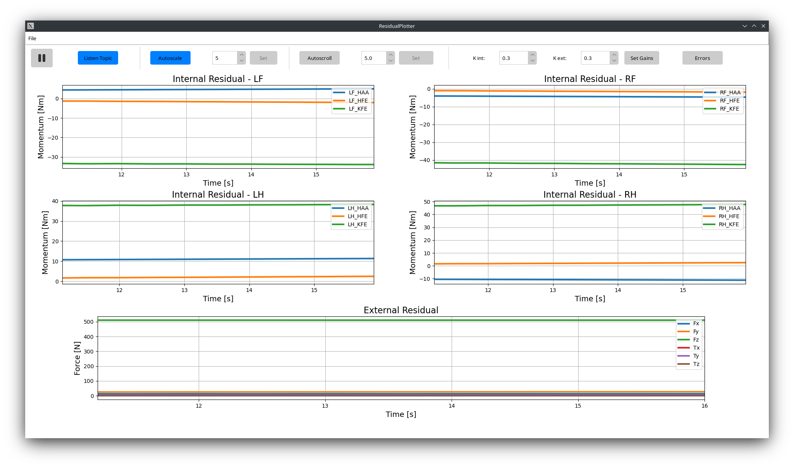
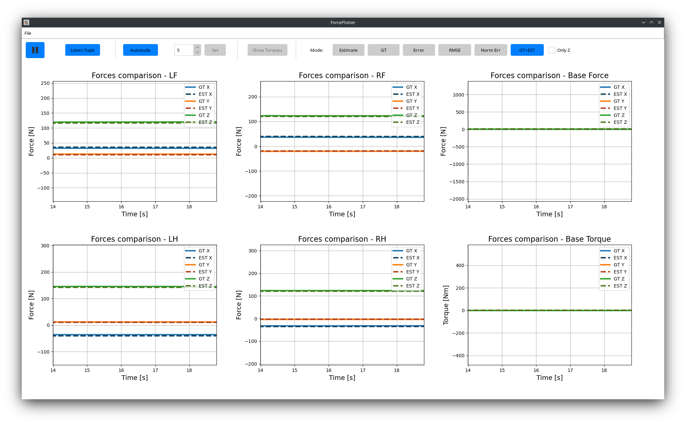

# haptiquad_ros2
## Description
`haptiquad_ros2` is a ROS2 humble wrapper for the [`haptiquad`](https://github.com/mlisi1/haptiquad) library. The main purpose of this wrapper is to interface the library with different simulations (Gazebo, Mujoco and rosbags for the moment) and be able to calculate residuals and estimate ground reaction forces. This repo offers the following packages:
+ `haptiquad` - the library implementing all the core code
+ `haptiquad_ros2` - contains the wrappers for the different simulations
+ `haptiquad_msgs` - messages for residuals, force, and errors
+ `haptiquad_plot` - implements visualization tools for estimated data as well as some debugging tools

## Installation:
To install the package use the following commands:
```bash
git clone git@github.com:mlisi1/haptiquad_ros2.git
cd haptiquad_ros2/
git submodule update --init
cd ..
bash haptiquad_ros2/build.sh
source install/setup.bash
```
The build command will succeed only if the required packages for at least one of the simulation wrappers are present; otherwise, it will fail.

## Usage
To use `haptiquad_ros2` wrapper with any of the already implemented simulations, use the following launch files:
```bash
ros2 launch haptiquad_ros2 mujoco_wrapper.launch.py      #Mujoco wrapper
ros2 launch haptiquad_ros2 gazebo_wrapper.launch.py      #Gazebo wrapper
ros2 launch haptiquad_ros2 bag_wrapper.launch.py         #Rosbag wrapper
```
Every wrapper has some topics in common under the `/haptiquad_ros2` namespace:
```
/gains              # Subscribed - allows to change the observer's gains during runtime
/friction           # Subscriber - allows to change friction parameters during runtime
/residuals          # Published - internal and external residuals are published here
/residual_errors    # Published - (optionally) the residual error (between estimated residuals and calculated residuals from the real force measurements)
/estimated_forces   # Published - published the estimated foces
```

Beside these topics, there are subscription topics to joint states, floating base spatial velocity and orientation, and real values of contact forces. These depend on the type of simulation.

---
Another useful tool is `haptiquad_plot`, which allows to visualize the residuals and estimated forces errors.
### Residual Plotter
ResidualPlotter allows to see both the external and internal residual, with the latter one divided for the robot legs. The node has implemented callbacks for the same simulations as the wrappers.

It can be tweaked by modifying the following parameters:
```yaml
x_lim:  10.0            # seconds interval to plot; it is equivalent to the Autoscroll button and spinbox
autoscale: True         # toggles plots Y axis autoscaling; it is equivalent to the Autoscale button
meoty_limit: 1000       # max length of data saved
listening:  True        # whether to start listening to topics when started or not
legs_prefix : []        # list of strings containing the prefixes identifying the robot legs
```
Beside plotting residuals, it is possible to change the observer's gains during runtime and switch to the visualization of reisudal error (if available).
### ForcePlotter
ForcePlotter is a node that allows to plot estimated forces, as well as error data calculated with the real force measurements. Similarly to the previous tool, it contains the correct callbacks to interface with the implemented simulations.

It is possible to visualize:
+ Estimated forces only (Estimate)
+ Real measurements from simulation (GT)
+ Error between real and estimated forces (Error)
+ RMSE
+ Norm error, calculated excluding the torque components (Norm)
+ Estimated and real forces in the same plot (GT+EST)

The tool's parameters are the same as ResidualPlotter's, with the addition of `foot_suffix`, which is a string specifying the suffix in the feet frames' name. For example, ANYmal C has feet frames named "LF_FOOT", "RF_FOOT", and so on, thus the parameter shall be "FOOT".

## Adding new wrappers:
`haptiquad_ros2` allows the creation of new wrappers without much code modifications. It contains the WrapperBase class (`haptiquad_ros2/src/wrapper_base.hpp`), which implements all the common methods and attributes. The only additions needed to add new wrappers is the creation of a new class inheriting from WrapperBase, which adds the necessary subscription to the needed data topics (usually, message_filters are used, as it's unlikely to have a single topic for everything), and its relative callback.

---

For examples of complete simulations see: [`haptiquad_mujoco`](https://github.com/mlisi1/haptiquad_mujoco/tree/main), [`haptiquad_gazebo`](https://github.com/mlisi1/haptiquad_gazebo), [`haptiquad_rosbag`](https://github.com/mlisi1/haptiquad_rosbag)
